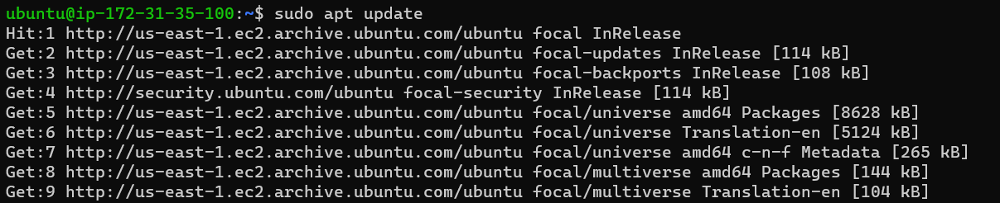
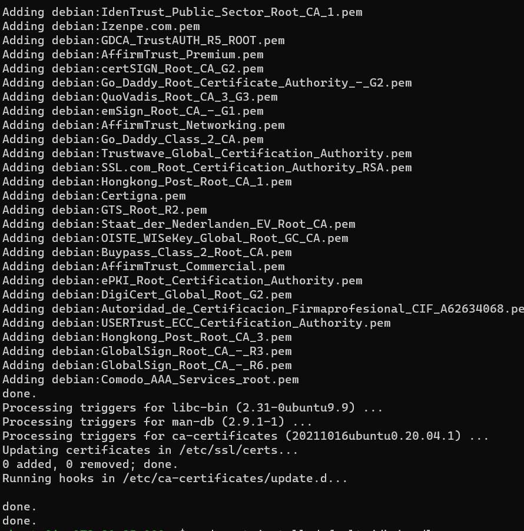
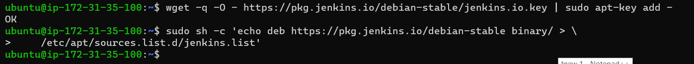
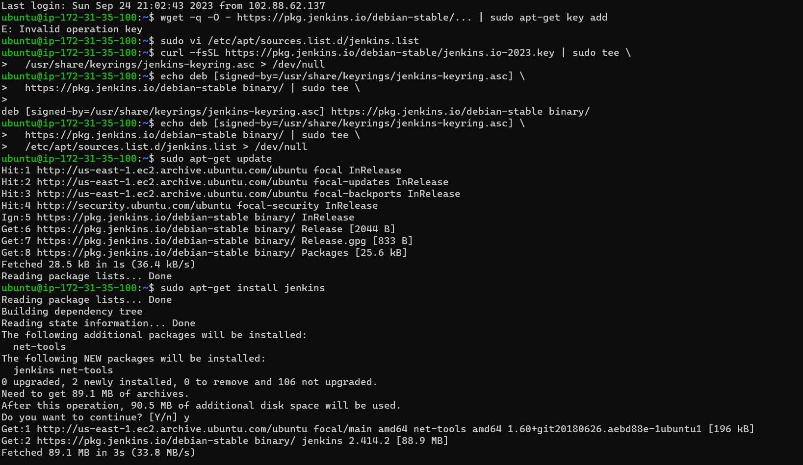
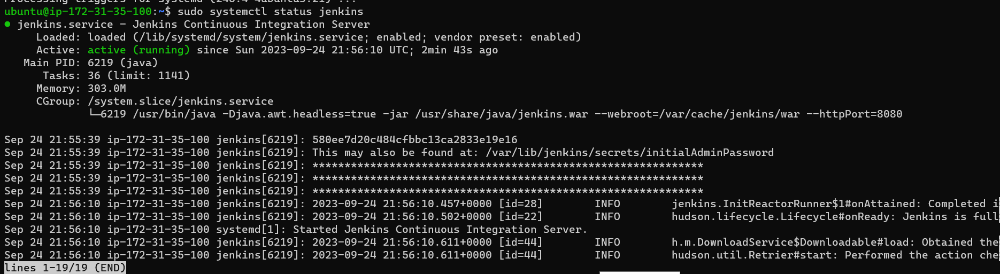
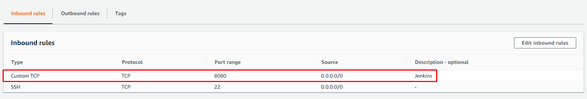
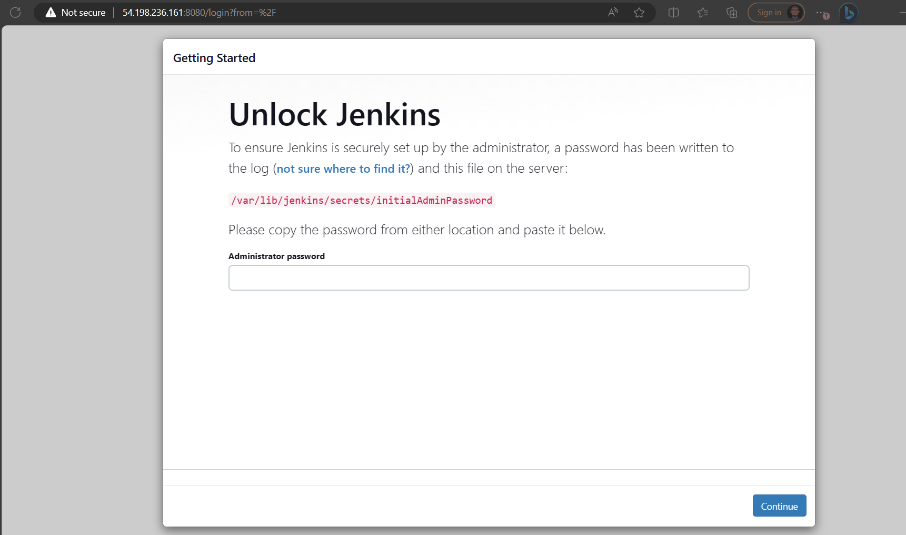
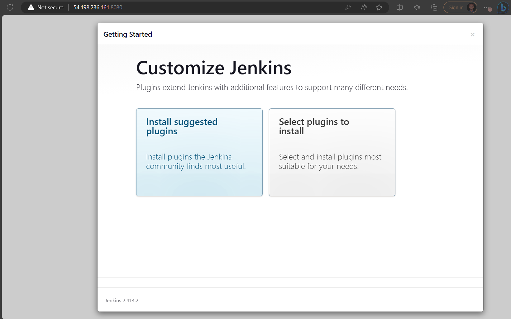

# CONTINOUS INTEGRATION PIPELINE FOR TOOLING WEBSITE

## INSTALL AND CONFIGURE JENKINS SERVER

### Step 1 – Install Jenkins server

### Create an AWS EC2 server based on Ubuntu Server 20.04 LTS and name it “Jenkins”

### Install JDK (since Jenkins is a Java-based application)

```
sudo apt update
sudo apt install default-jdk-headless
```





### Install Jenkins

```
wget -q -O - https://pkg.jenkins.io/debian-stable/jenkins.io.key | sudo apt-key add -
sudo sh -c 'echo deb https://pkg.jenkins.io/debian-stable binary/ > \
    /etc/apt/sources.list.d/jenkins.list'
sudo apt update
sudo apt-get install jenkins
```





### Make sure Jenkins is up and running

`sudo systemctl status jenkins`



### By default Jenkins server uses TCP port 8080 – We open it by creating a new Inbound Rule in your EC2 Security Group



### Perform initial Jenkins setup.

### From the browser access:
[Jenkins Setup](http://<Jenkins-Server-Public-IP-Address-or-Public-DNS-Name>:8080))

### I will be prompted to provide a default admin password



### Password is retrieved from the jenkins server:

`sudo cat /var/lib/jenkins/secrets/initialAdminPassword`

### Then I will be asked which plugins to install – suggested plugins.

