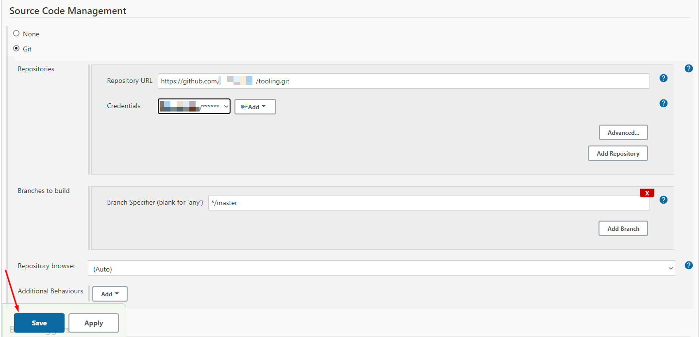
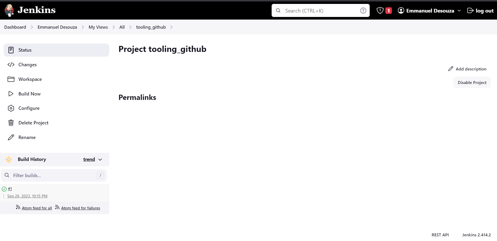
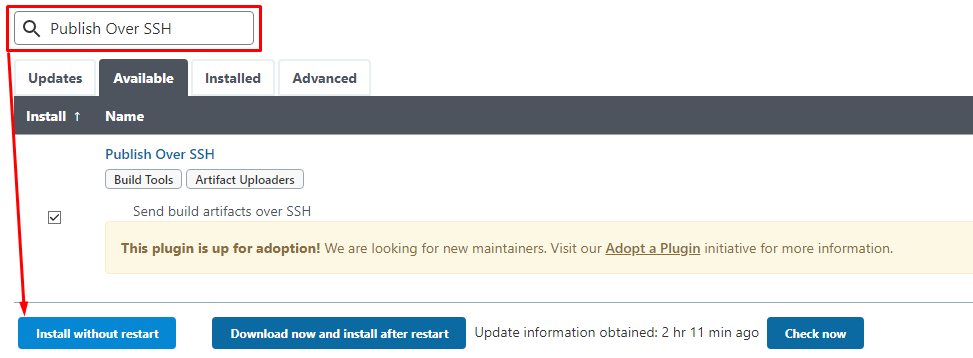

# CONTINOUS INTEGRATION PIPELINE FOR TOOLING WEBSITE

## INSTALL AND CONFIGURE JENKINS SERVER

### Step 1 – Install Jenkins server

### Create an AWS EC2 server based on Ubuntu Server 20.04 LTS and name it “Jenkins”

### Install JDK (since Jenkins is a Java-based application)

```
sudo apt update
sudo apt install default-jdk-headless
```


### Install Jenkins

```
wget -q -O - https://pkg.jenkins.io/debian-stable/jenkins.io.key | sudo apt-key add -
sudo sh -c 'echo deb https://pkg.jenkins.io/debian-stable binary/ > \
    /etc/apt/sources.list.d/jenkins.list'
sudo apt update
sudo apt-get install jenkins
```


### Make sure Jenkins is up and running

`sudo systemctl status jenkins`


### By default Jenkins server uses TCP port 8080 – We open it by creating a new Inbound Rule in your EC2 Security Group


### Perform initial Jenkins setup.

### From the browser access:
[Jenkins Setup](http://<Jenkins-Server-Public-IP-Address-or-Public-DNS-Name>:8080))

### I will be prompted to provide a default admin password


### Password is retrieved from the jenkins server:

`sudo cat /var/lib/jenkins/secrets/initialAdminPassword`

### Then I will be asked which plugins to install – suggested plugins.


### Once plugins installation is done – create an admin user and you will get your Jenkins server address.

### The installation is completed!


### Step 2 – Configure Jenkins to retrieve source codes from GitHub using Webhooks
### In this part, you will learn how to configure a simple Jenkins job/project (these two terms can be used interchangeably). This job will will be triggered by GitHub webhooks and will execute a ‘build’ task to retrieve codes from GitHub and store it locally on Jenkins server.

### 1. Enable webhooks in your GitHub repository settings


### 2. Go to Jenkins web console, click “New Item” and create a “Freestyle project”


### To connect your GitHub repository, you will need to provide its URL, you can copy from the repository itself


### In configuration of your Jenkins freestyle project choose Git repository, provide there the link to your Tooling GitHub repository and credentials (user/password) so Jenkins could access files in the repository.




### Save the configuration and let us try to run the build. For now we can only do it manually.
### Click “Build Now” button, if you have configured everything correctly, the build will be successfull and you will see it under #1



### You can open the build and check in “Console Output” if it has run successfully.

### If so – congratulations! You have just made your very first Jenkins build!


### But this build does not produce anything and it runs only when we trigger it manually. Let us fix it.


### 3. Click “Configure” your job/project and add these two configurations
### Configure triggering the job from GitHub webhook:

### Configure “Post-build Actions” to archive all the files – files resulted from a build are called “artifacts”.

### Now, go ahead and make some change in any file in your GitHub repository (e.g. README.MD file) and push the changes to the master branch.

### You will see that a new build has been launched automatically (by webhook) and you can see its results – artifacts, saved on Jenkins server.


### I have now configured an automated Jenkins job that receives files from GitHub by webhook trigger (this method is considered as ‘push’ because the changes are being ‘pushed’ and files transfer is initiated by GitHub). There are also other methods: trigger one job (downstreadm) from another (upstream), poll GitHub periodically and others.

### By default, the artifacts are stored on Jenkins server locally

`ls /var/lib/jenkins/jobs/tooling_github/builds/<build_number>/archive/`

## CONFIGURE JENKINS TO COPY FILES TO NFS SERVER VIA SSH

### Step 3 – Configure Jenkins to copy files to NFS server via SSH
### Now we have our artifacts saved locally on Jenkins server, the next step is to copy them to our NFS server to /mnt/apps directory.

### Jenkins is a highly extendable application and there are 1400+ plugins available. We will need a plugin that is called “Publish Over SSH”.

### 1. Install “Publish Over SSH” plugin.
### On main dashboard select “Manage Jenkins” and choose “Manage Plugins” menu item.

### On “Available” tab search for “Publish Over SSH” plugin and install it 



### 2. Configure the job/project to copy artifacts over to NFS server.
### On main dashboard select “Manage Jenkins” and choose “Configure System” menu item.

### Scroll down to Publish over SSH plugin configuration section and configure it to be able to connect to your NFS server:

### 1. Provide a private key (content of .pem file that you use to connect to NFS server via SSH/Putty)
### 2. Arbitrary name
### 3. Hostname – can be private IP address of your NFS server
### 4. Username – ec2-user (since NFS server is based on EC2 with RHEL 8)
### 5. Remote directory – /mnt/apps since our Web Servers use it as a mointing point to retrieve files from the NFS server
### Test the configuration and make sure the connection returns Success. Remember, that TCP port 22 on NFS server must be open to receive SSH connections.


### Save the configuration, open your Jenkins job/project configuration page and add another one “Post-build Action”


### Configure it to send all files produced by the build into our previously define remote directory. In our case we want to copy all files and directories – so we use **.


### Save this configuration and go ahead, change something in README.MD file in your GitHub Tooling repository.


### Webhook will trigger a new job and in the “Console Output” of the job you will find something like this:


### To make sure that the files in /mnt/apps have been updated – connect via SSH/Putty to your NFS server and check README.MD file

`cat /mnt/apps/README.md`

### If I see the changes I previously made in my GitHub – the job worked as expected.


# Success

### I have just implemented my first Continuous Integration solution using Jenkins CI. Watch out for advanced CI configurations in upcoming projects.

